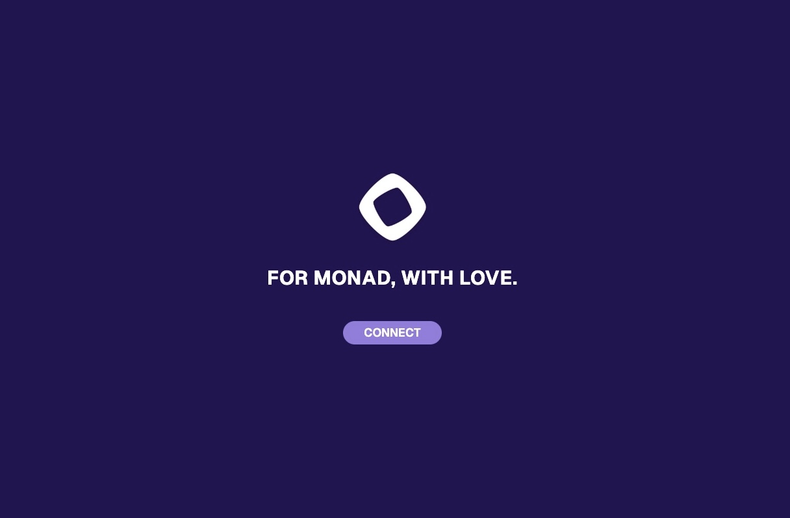

# 🏛️ Monument - For Monad, With Love

[](https://monumentv1.vercel.app)
[](LICENSE)

A collaborative web app where the Monad community creates a digital monument together. Join thousands of community members by placing your tile on an ever-growing celebration wall.



## 🌟 What is Monument?

Monument is an interactive community celebration app built for the Monad ecosystem. It's a digital canvas where up to **10,000 participants** can leave their mark by:

- Entering their X (Twitter) handle
- Uploading their avatar as a tile on a collaborative mural
- Being part of a living, breathing community artwork

Each participant's contribution is permanently stored and displayed on the Monument wall for all to see.

## ✨ Features

### 🎨 Interactive Celebration Wall

- **10,000 Tile Capacity**: A massive collaborative artwork made up of 10,000 unique participant tiles
- **Real-time Updates**: Watch the wall grow as new community members join
- **Responsive Grid**: Optimized viewing experience on both desktop (40×25 grid) and mobile (30×15 grid)
- **Pagination**: Navigate through multiple pages to explore all participants
- **Your Tile Highlighted**: Your contribution is highlighted with a golden ring when you join

### 👤 Personalization

- **X (Twitter) Handle**: Submit your social handle to be part of the monument
- **Avatar Upload**: Upload your own image or use your X profile picture
- **Unique Identity**: Each username can only participate once, ensuring authenticity
- **Live Avatar Display**: Your X avatar stays updated in real-time on the wall

### 🎯 User Experience

- **Smooth Onboarding**: Simple 3-step process to join
- **Username Validation**: Real-time checking to ensure handle availability
- **Progress Tracking**: Visual feedback throughout the joining process
- **Confetti Celebration**: Celebratory animation when you successfully join
- **Social Sharing**: Share your tile on X (Twitter) with one click
- **Secret Easter Egg**: Discover the hidden door 🚪 for a special surprise

### 📱 Responsive Design

- **Mobile Optimized**: Fully responsive on all device sizes
- **Touch Friendly**: Smooth interactions on mobile devices
- **Desktop Enhanced**: Click any tile to view participant details
- **Lazy Loading**: Optimized image loading for smooth performance
- **Purple Theme**: Beautiful Monad-branded color scheme (#200152)

## 🚀 How to Participate

### Step 1: Join the Monument

1. Visit [Monument](https://monumentv1.vercel.app)
2. Click the **JOIN THE MONUMENT** button

### Step 2: Submit Your Handle

1. Enter your **X (Twitter) handle** (without the @)
2. The system will check if it's available
3. Click **SUBMIT** to proceed

### Step 3: Upload Your Avatar

1. You'll see the upload interface
2. **Drag and drop** your avatar image, or click to browse
3. Accepted formats: JPEG, PNG, WebP, GIF (max 10MB)
4. Your image will be automatically resized to 64×64 pixels
5. Click upload and wait for processing

### Step 4: Celebrate! 🎉

1. Enjoy the confetti celebration
2. Share your tile on X (Twitter)
3. Explore the wall and see other participants
4. Your tile is now permanently part of the Monument

## 🎨 The Celebration Wall

### Navigation

- **Page Selector**: Navigate through multiple pages using Previous/Next buttons
- **Counter Display**: See how many tiles have been placed (e.g., "1,234 / 10,000 placed")
- **Current Page**: Shows which page you're viewing

### Viewing Tiles

- **Desktop**: Click any tile to see detailed information about that participant
  - Username and X handle
  - Position number (e.g., #1,234 / 10,000)
  - Join date
  - Live avatar display
  - Monument statistics
- **Mobile**: Optimized grid view for touch devices

### Real-time Features

- New participants appear automatically as they join
- Updates batch every 500ms for optimal performance
- Live avatar syncing from X (Twitter)

## 🔐 Technical Highlights

### Tech Stack

- **Frontend**: Next.js 15, React 18, TypeScript
- **Styling**: Tailwind CSS 4, Radix UI components
- **Backend**: Supabase (database & storage)
- **Realtime**: Supabase subscriptions
- **Analytics**: Vercel Analytics

### Data Storage

- **Database**: X handle, avatar filename, join timestamp
- **Storage**: Avatar images
- **Real-time Sync**: Live updates via WebSocket subscriptions

## 🎁 Easter Eggs

Keep an eye out for hidden surprises! There's a secret door (🚪) somewhere on the celebration wall that leads to something special...

## 🤝 Community

Monument is built by the community, for the community. Join thousands of Monad enthusiasts who have already left their mark!

### Connect with Monad

- **Website**: [monad.xyz](https://monad.xyz)
- **Twitter**: [@MonadXYZ](https://x.com/Monad)
- **Discord**: Join the Monad community

### Share Your Tile

After joining, share your participation with the community:

```
I just placed my tile in the Monument! 🎨 Join the celebration at monumentv1.vercel.app
```

## 📊 Statistics

- **Total Capacity**: 10,000 tiles
- **Grid Layout**:
  - Desktop: 40×25 tiles per page (1,000 tiles)
  - Mobile: 30×15 tiles per page (450 tiles)
- **Image Size**: 64×64 pixels per tile
- **Max Upload**: 10MB per image

## 🔒 Privacy & Security

- **Minimal Data**: Only your X handle and avatar are stored
- **One Tile Per Handle**: Each username can only participate once
- **Secure Storage**: Images stored securely on Supabase
- **No Personal Data**: No email, phone, or personal information required

## 🐛 Troubleshooting

### Upload Issues

- Check file size is under 10MB
- Ensure image format is JPEG, PNG, WebP, or GIF
- Try a different image if upload fails

### Username Already Taken

- Choose a different X handle
- Check for typos in your handle
- The system checks in real-time for availability

### General Issues

- Try refreshing the page
- Clear your browser cache
- Use a modern browser (Chrome, Firefox, Safari, Edge)

## 📝 License

This project is open source and available under the MIT License.

## 💜 Credits

Built with love for the Monad community.

Special thanks to:

- The Monad team for building an amazing ecosystem
- All community members who contributed their tiles

---

**Join the Monument today and become part of Monad history! 🏛️✨**

[monumentv1.vercel.app](https://monumentv1.vercel.app)
